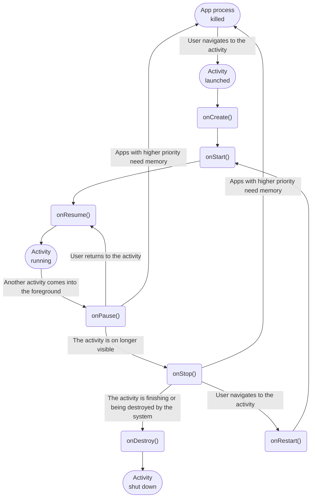
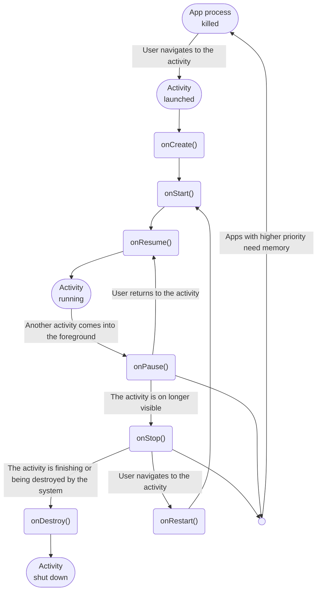

# ANDROID

> [!fail]- ESTE APARTADO ESTÁ INCOMPLETO
> > [!todo] #TODO

%%

```mermaid
flowchart TB
    appProcessKilled(["App process<br>killed"])
    activityRunning(["Activity<br>running"])
    activityLaunched(["Activity<br>launched"])
    activityShutDown(["Activity<br>shut down"])
    onCreate("onCreate()")
    onStart("onStart()")
    onResume("onResume()")
    onPause("onPause()")
    onStop("onStop()")
    onDestroy("onDestroy()")
    onRestart("onRestart()")

    activityLaunched -->
    onCreate -->
    onStart -->
    onResume -->
    activityRunning -- Another activity comes into the foreground -->
    onPause -- The activity is on longer visible -->
    onStop -- The activity is finishing or being destroyed by the system -->
    onDestroy -->
    activityShutDown

    onPause -- User returns to the activity -->
    onResume


    onStop -- User navigates to the activity -->
    onRestart -->
    onStart

    onPause -- Apps with higher priority need memory -->
    appProcessKilled

    onStop -- Apps with higher priority need memory -->
    appProcessKilled -- User navigates to the activity -->
    activityLaunched

```

```mermaid
flowchart TB
    appProcessKilled(["App process<br>killed"])
    activityRunning(["Activity<br>running"])
    activityLaunched(["Activity<br>launched"])
    activityShutDown(["Activity<br>shut down"])
    onCreate("onCreate()")
    onStart("onStart()")
    onResume("onResume()")
    onPause("onPause()")
    onStop("onStop()")
    onDestroy("onDestroy()")
    onRestart("onRestart()")
    union((" "))


    activityLaunched -->
    onCreate -->
    onStart -->
    onResume -->
    activityRunning -- Another activity comes into the foreground -->
    onPause -- The activity is on longer visible -->
    onStop -- The activity is finishing or being destroyed by the system -->
    onDestroy -->
    activityShutDown

    onPause -- User returns to the activity -->
    onResume

    onStop -- User navigates to the activity -->
    onRestart -->
    onStart

    onStop -->
    union -- Apps with higher priority need memory -->
    appProcessKilled -- User navigates to the activity -->
    activityLaunched

    onPause -->
    union
```
%%