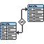

<h1 align="center">BASES DE DATOS</h1>

---

# BASES DE DATOS

> [!fail]- ESTE APARTADO ESTÁ INCOMPLETO
> > [!todo] #TODO

> [!warning] ATENCIÓN
> Esta documentación está escrita a todo correr debido a los exámenes, por lo que hay muchas cosas que faltan, están incompletas y muy posiblemente erróneas, está totalmente sujeto a cambios, ya que me gustaría en un futuro reformularlo todo y pasarlo a limpio, además de actualizarlo ya que el contenido que recibí a la hora de hacer esta documentación considero que estaba anticuado.

- [Tema 1](t1/db_t1.md)
- [Tema 2](t2/db_t2.md)
- [Tema 3](t3/db_t3.md)
- [Tema 4](t4/db_t4.md)
- [Tema 5](t5/db_t5.md)
