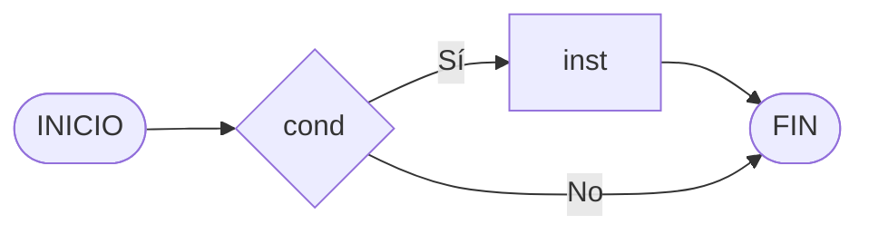
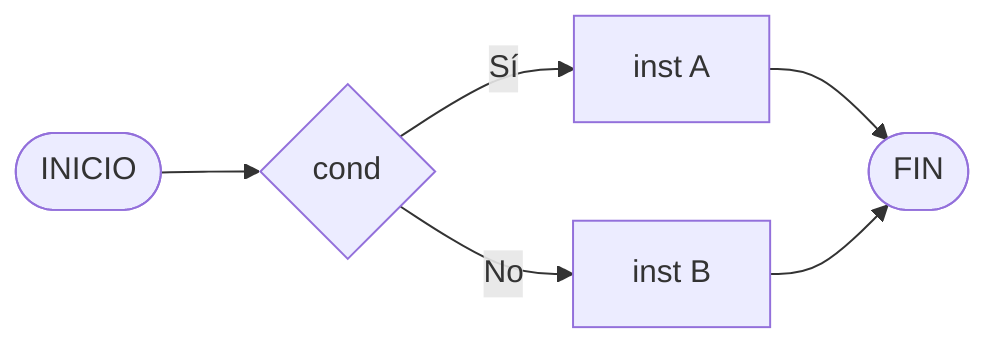
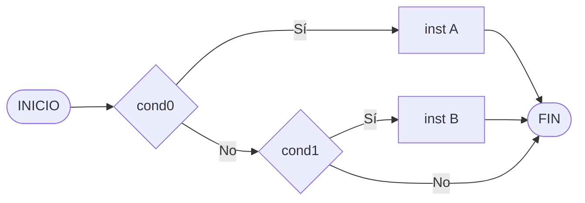
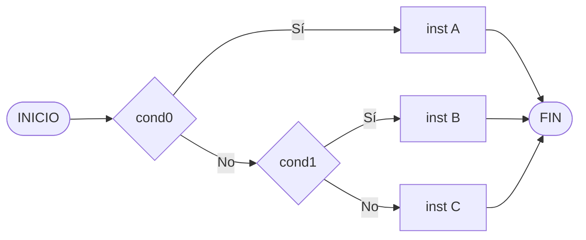
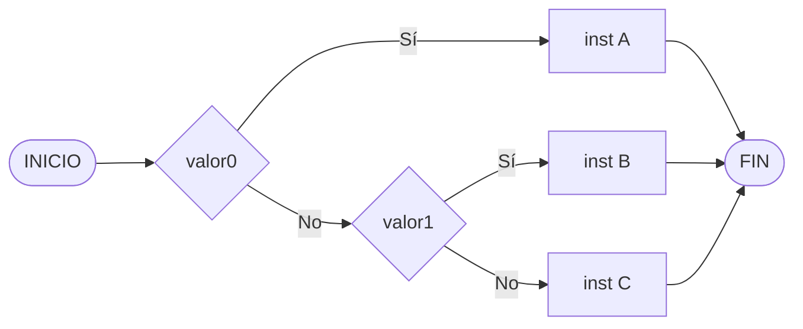

# CONDICIONALES EN MYSQL

> [!fail]- ESTE APARTADO ESTÁ INCOMPLETO
> > [!todo] #TODO
> > - [ ] Documentar el `IF`.
> > - [ ] Documentar el `IF ELSE`.
> > - [ ] Documentar el `IF ELSEIF`.
> > - [ ] Documentar el `CASE WHEN`.

> [!faq]- FAQ
> - [¿Qué es el control de flujo en programación?](../../../pc/pc_control_flow.md)
> - [¿Qué son los operadores de comparación en MySQL?](mysql_operators.md)

## CONDICIONES

Para poder indicar cuando se cumplen una condición y así ejecutar el código que nosotros queramos bajo ciertas circunstancias necesitaremos conocer los [operadores de comparación](mysql_operators.md) en **MySQL**.

### CONDICIÓN



```sql
IF cond THEN
    -- instrucción;
    -- ...
END IF;
```

### CONDICIÓN SINO



```sql
IF condición THEN
    -- instrucción;
    -- ...
ELSE
    -- instrucción;
    -- ...
END IF;
```

### CONDICIÓN MÚLTIPLE



```sql
IF condición0 THEN
    -- instrucción;
    -- ...
ELSEIF condición1 THEN
    -- instrucción;
    -- ...
END IF;
```



```sql
IF condición0 THEN
    -- instrucción;
    -- ...
ELSEIF condición1 THEN
    -- instrucción;
    -- ...
ELSE
    -- instrucción;
    -- ...
END IF;
```

## CASE WHEN


```sql
CASE expresión
WHEN valor0 THEN
    -- instrucción;
    -- ...
WHEN valor1 THEN
    -- instrucción;
    -- ...
END CASE;
```



```sql
CASE expresión
WHEN valor0 THEN
    -- instrucción;
    -- ...
WHEN valor1 THEN
    -- instrucción;
    -- ...
ELSE
    -- instrucción;
    -- ...
END CASE;
```
