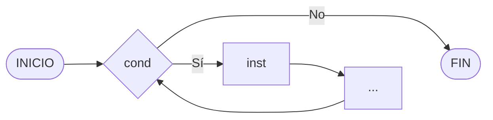
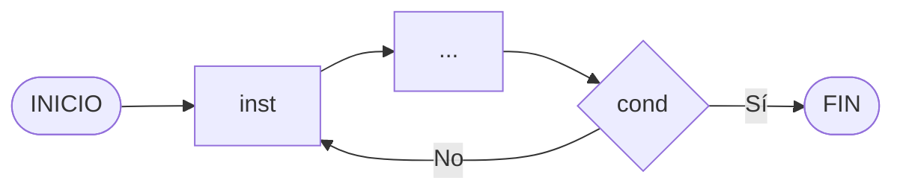

# BUCLES EN MYSQL

> [!fail]- ESTE APARTADO ESTÁ INCOMPLETO
> > [!todo] #TODO
> > - [ ] Bucle `while`.
> >     - [x] Explicar el bucle `while`.
> >     - [ ] Poner un ejemplo del bucle `while`.
> > - [ ] Bucle `until`.
> >     - [x] Explicar el bucle `until`.
> >     - [ ] Poner un ejemplo del bucle `until`.

> [!faq]- FAQ
> - [¿Qué son lo bucles en programación?](../../../pc/pc_loop.md)

## BUCLE WHILE

El bucle `WHILE` repetirá las instrucciones dentro de su ámbito mientras se cumpla la condición especificada, esta condición se expresará mediante los [operadores](mysql_operators.md).



```sql
WHILE cond DO
    -- instrucción;
    -- ...
END WHILE;
```

## BUCLE UNTIL

> [!important] IMPORTANTE
> Este bucle es como el *Do-While*, con la diferencia que este no se repite mientras se cumpla la condición, sino que se repite asta que se cumpla.

El bucle `UNTIL` repetirá las instrucciones dentro de su ámbito ==mientras no se cumpla== la condición especificada, ejecutando siempre una vez antes de empezar a tener en cuenta la condición, esta condición se expresará mediante los [operadores](mysql_operators.md).



```sql
REPEAT
    -- instrucción;
    -- ...
UNTIL cond
END REPEAT;
```
