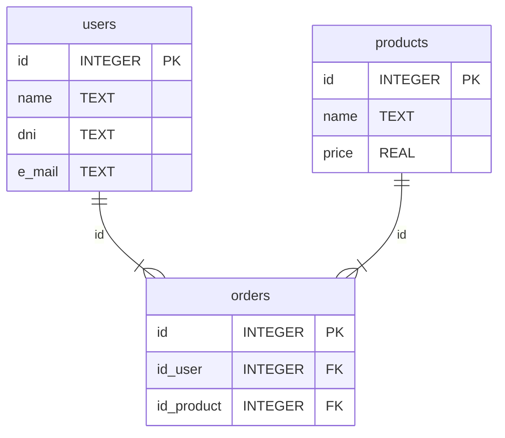
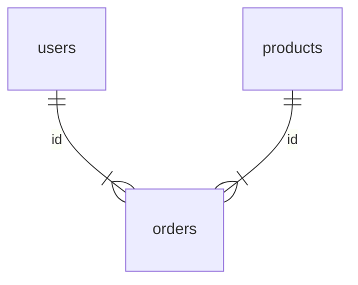

# Tema 1: Introducción a las DDBB

> [!fail]- ESTE APARTADO ESTÁ INCOMPLETO
> > [!todo] #TODO

## 1.1 Evolución histórica de las DDBB

Las **DDBB** se empezaron a usar a partir de 1970, previo a esto se usaban archivos para guardar la información.

La información se guarda en la memoria de los equipos, estos tienen dos tipos:
- Primaria (**RAM**).
- Secundaria (**CD, DVD, HDD, SSD, etc**).

La memoria **RAM** es volátil, esto quiere decir que cuando se apaga el equipo, toda la información almacenada en ella desaparece, a diferencia de lo que ocurre con la memoria secundaria.

La información en la **memoria secundaria** se almacena en forma de archivos.

Los ficheros se dividían en registros, y los registros en campos, de forma que terminaban obteniendo una forma de tabla, en la que se guardaba un registro por cada cliente y un campo por cada dato del registro del cliente:

| DNI       | Nombre | Apellido     | e-mail   | Teléfono  |
|:--------- |:------ |:------------ |:-------- |:--------- |
| 12345678A | Ana    | Gil Ruiz     | agr@r.es | 123456789 |
| 23456789B | Luis   | Gómez García | lgg@r.es | 234567890 |

A la hora de usar ficheros para almacenar información, esta es ordenada de una forma específica, dictada por el programa que se encarga de administrar la información, esto provoca que la información almacenada en este o estos ficheros es dependiente del programa, ya que sin el la información no se puede interpretar, esto también conlleva que si queremos hacer alguna modificación a la información que queremos almacenar, como puede ser añadir un nuevo campo (*por ejemplo la dirección de un domicilio*), implicaría cambiar tanto el programa como los ficheros que almacenan la información.

Esta forma de almacenar la información ==es propensa a tener **redundancias**== (*esto quiere decir que se repite la información*), esto ==abre la posibilidad de que ocurran **inconsistencias**== (*esto quiere decir que entre los datos repetidos, se modifiquen unos y no otros, creado así la inconsistencia*).

Esta forma de trabajar recibe el nombre de "==**sistema orientado al proceso**==" ya que es dependiente del proceso que se lleva a cabo con ellos.

Una DDBB se puede definir como:

> Una colección o depósito de datos integrados con redundancia controlada y con una estructura que refleje las interrelaciones y restricciones existentes en el mundo real.
> 
> *Piattini et al, 2006*

## 1.2 Ventajas e inconvenientes de las DDBB

- ==Independencia de los datos respecto a los tratamientos y viceversa==: esto quiere decir que si se modifica al **DDBB** no se deberá obligatoriamente cambiar el programa que accede a ella y viceversa.
- ==Consistencia de los datos==: el gestor de la **DDBB** es el encargado de hacer las relaciones entre los registros, provocando así que la **redundancia** sea mínima y controlada, evitando las **inconsistencias**, únicamente repitiéndose los datos estrictamente necesarios.
- ==Compartición de los datos==: en el sistema de archivos solo accedían a los datos los propietarios de los archivos, a diferencia de las **DDBB**, en donde cualquier persona con acceso permitido (*mediante un usuario y contraseña*) puede acceder a la **DDBB**, está a su vez podrá realizar unas acciones u otras sobre la **DDBB** dependiendo de los privilegios que tenga sobre esta. De la asignación de los usuarios y sus privilegios se encargará el **administrador de la DB** (*DBA*), cabe resaltar que los usuarios pueden tener **roles** indicando estos los tipos de privilegios que tienen sobre la **DDBB**.
- ==Mayor valor informativo==: debido a que la ==información está relacionada el valor== que adquiere la información ==es mayor==.
- ==Mejora en la accesibilidad a los datos==: los **Sistemas de Gestión de Bases de Datos** (*SGBD*) incluyen lenguajes como **SQL**, que permite acceder y manipular la información de la **DDBB** de forma sencilla.
- ==Mejora en la integridad de los datos==: esto se refiere a que el **SGBD** se encargará de que nadie meta por ejemplo un texto en donde se debe introducir un número, haciendo que los datos sean consistentes y válidos.
- ==Control de la concurrencia==: en el sistema de ficheros varios usuarios podían acceder a la información de forma simultánea, poniendo en riesgo la integridad de los datos, en las **DDBB** el **SGBD** es el encargado de hacer que los cambios se hagan de uno en uno.
- ==Reducción del espacio de almacenamiento==: la casi desaparición de la **redundancia** conlleva que la información ocupe menos.

El uso de las DDBB también tiene ciertos problemas:

- ==Instalación costosa==: la implementación de un **SGBD** implica un mayor consumo de recursos, implicando que debemos gastar más dinero para la compra tanto del servidor en donde se va a alojar como en el mantenimiento de este.
- ==Personal especializado==: es necesaria la contratación de ==personal especializado en **SGBD**==.
- ==Falta de rentabilidad a corto plazo==: al tener un costo elevado el punto de rentabilidad de este sistema se aleja en el tiempo.

## 1.3 SGBD / DBMS

Un **Sistema de Gestión de Bases de Datos** (*SGBD*) en inglés ***Database Management System*** (*DBMS*), son una serie de programas que se encargan de administrar las **DDBB**.

> El **SGBD**) se encargará de gestionar el correcto funcionamiento interno de la base de datos, en lo que se refiere al control de la concurrencia y de la integridad, además de facilitar a los usuarios la creación, el mantenimiento y, en ocasiones, el diseño de dicha **DDBB**.
> 
> *Oltra et al. (2006)*

## 1.4 Anomalías del acceso concurrente

Como a una **DDBB** pueden acceder varios procesos al mismo tiempo, podrían ocasionar se discrepancias, para solucionar esto, el **SGBD** puede aplicar dos tipos de bloqueos a las tablas, filas o columnas dependiendo de las circunstancias:

- Modo compartido: uno o varios procesos pueden acceder únicamente para leer la información que ha sido bloqueada con este modo.
- Modo exclusivo: un único proceso tiene el permiso para leer y escribir.

La información por defecto siempre está libre, cuando un proceso quiere leer este pide un permiso de lectura, cambiado el esto de la información que necesita a **modo compartido** en el caso en el que esta esté **libre**, en este estado otros procesos que quieran leer esa misma información podrán hacerlo, una vez todos los procesos hayan terminado de leer el estado de esa información volverá al modo **libre**, si un proceso quiere escribir en una información, esta si se encuentra en modo **libre** se pondrá en **modo exclusivo** permitiendo únicamente leer o escribir al proceso que hizo la petición, una vez éste termine, la información volverá a estar en el modo libre.

## 1.5 Administración de los datos y DDBB

El **administrador de datos** es el encargado de conocer la información que necesita la empresa, como manejar los, organizarlos, etc.

El **administrador de la DDBB** es quien tiene conocimientos de un  **SGBD** y debe seguir las instrucciones del **administrador de datos** para crear una **DDBB** que cumpla con las características necesarias que considere en **administrador de datos**.

## 1.6 Niveles de arquitectura

El **administrador de la DDBB** es el encargado de indicar la estructura de la **DDBB** en varios niveles (*Arquitectura de los sistemas de DDBB*).

La arquitectura más establecida es [ANSI/X3/SPARC](https://es.wikipedia.org/wiki/Arquitectura_ANSI-SPARC).

- Nivel físico: es el nivel más bajo de abstracción, son básicamente sentencias SQL, este nivel es empleado por el **administrador de la DDBB**.

```sql
CREATE TABLE users {
    id     INTEGER PRIMARY KEY,
    name   TEXT NOT NULL,
    dni    TEXT NOT NULL,
    e_mail TEXT NOT NULL,
}

CREATE TABLE products {
    id    INTEGER PRIMARY KEY,
    name  TEXT NOT NULL,
    price REAL NOT NULL
}

CREATE TABLE orders {
    id         INTEGER PRIMARY KEY,
    id_user    INTEGER,
    id_product INTEGER,
    order_date TEXT NOT NULL,
    FOREIGN KEY(id_user) REFERENCES users(id),
    FOREIGN KEY(id_product) REFERENCES orders(id)
}
```

- Nivel lógico o conceptual: se describe a nivel lógico la información que se va a guardar, de qué forma, relaciones entre tablas, restricciones de integridad y restricciones de usuarios, este nivel es empleado por el **administrador de la DDBB**.



- Nivel externo o de vistas: está pensada para que los usuarios ajenos al interior de la **DDBB** sepan cual es la estructura que contiene, una vista general sin entrar mucho en detalle.



## 1.7 Modelos de datos

> [!note] RESUMEN DE ESTE APARTADO
> Lo que intentamos recrear en la **DDBB** es el ==**universo del discurso** (*UD*)==.
> 
> Los modelos de datos son en esencia los esquemas de **E-R**, en donde expresamos la forma en la que vamos a organizar la **DDBB**.
> 
> La parte **estática** de un modelo de datos es el diagrama que representa la estructura y relaciones de la **DDBB**, teniendo dos componentes:
> - Modelos permitidos:
>     - Entidades.
>     - Atributos.
>     - Dominios (*Valores permitidos en un campo*).
>     - Relaciones entre entidades.
> - Restricciones: restringen los valores que se pueden guardar en la **DDBB**, por ejemplo, no se puede meter un texto en un campo numérico.
> 
> Esquema de **ocurrencias**, es un esquema en el que se muestra un ejemplo de una **DDBB** con datos, seguido de un proceso que se le va a aplicar y finalmente la *ocurrencia* de la **DDBB** resultante.

Cuando creamos una **DDBB** lo hacemos queriendo plasmar una parte de la realidad dentro de ella para poder trabajar con esa información, a esa parte de la realidad que queremos recrear se le llama ==**universo del discurso** (*UD*)==.

A la hora de crear una **DDBB** se usan los llamados **modelos de datos**, estos son un conjunto de símbolos, conceptos y reglas que representan los datos que se van a almacenar.

El uso de estos modelos de datos estructurados representados por la **UD** crea un esquema.

Existen varios modelos de datos aplicables a cada momento de creación de una **DDBB** (*modelos conceptuales, lógicos y físicos*) dando lugar a diferentes esquemas (*esquema conceptual, lógico y físico*).

Los modelos de datos tienen una parte estática y otra dinámica:

- La parte estática de un modelo de dato tiene elementos permitidos y restricciones:
    - Los modelos permitidos no son siempre los mismos pero la mayoría tienen los siguientes:
        - Entidades.
        - Atributos o propiedades (*de la entidad*).
        - Dominios o conjuntos de valores sobre los que se definen los atributos.
        - Relaciones entre objetos.
    - Restricciones: son **ocurrencias no permitidas**, son valores que no se pueden almacenar en una **DDBB**.
- El estado de la DDBB se llaman ==**ocurrencias del esquema**== o **estado de la DDBB** en un instante de tiempo, por tanto, un cambio en la **ocurrencia del esquema** genera otra **ocurrencia del esquema**.
$$
O(BDi) = BDj
$$
Esto quiere decir que si tenemos una **DDBB** e insertamos un nuevo registro, habremos cambiado de una **ocurrencia del esquema** a otra.

Para crear una **DDBB** se siguen los siguientes pasos:
- Diseño conceptual: consiste en representar el **UD** usando el modelo de datos conceptual, obteniendo un esquema conceptual. Estos modelos son altamente semánticos, por lo que son independientes del **SGBD**).
- Diseño lógico: consiste en coger el *diseño conceptual del punto anterior* y añadirle reglas, restricciones, etc. Este diseño cambiará dependiendo del modelo de **DDBB** que estemos usando (*orden cronológico, jerárquico, en red, relacional, orientado a objetos*).
- Diseño físico: consiste en coger el esquema lógico del punto anterior y con ayuda de un **SGBD** (*MySQL, PostgreSQL, SQLite 3*) crear todos los elementos que conforman la **DDBB** (*dominio, tablas, restricciones, índices, etc*).

### 1.7.1 Modelos de datos conceptuales

Los **modelos de datos conceptuales** son los primeros en hacerse en la creación de una **DDBB**, estos son altamente semánticos e independientes de la **DDBB**.

En estos modelos se describen los datos del [universo del discurso](<#1.7 Modelos de datos>), por lo que es independiente del **SGBD**).

Este modelo es el de relaciones de **E-R** ([*Entidad-Relación*](https://es.wikipedia.org/wiki/Modelo_entidad-relaci%C3%B3n)), este fue propuesto por *Peter Chen*.

### 1.7.2 Modelos de datos lógicos

Los modelos de datos lógicos se usan para hacer un esquema lógico que representa la estructura de la **DDBB**, este se obtiene del esquema conceptual, básicamente añadiéndole reglas de transformación que son diferentes dependiendo de la **DDBB** (*Jerárquicas, en red, relacionales u orientadas a objetos*), hoy en día es el modelo relacional.

El modelo relacional es el más moderno, siendo desarrollado en 1970, en este modelo se usan tablas realizando la representación lógica de los datos y las relaciones entre ellos.

Se le llama "*tupla*" a cada fila de la tabla y campo o atributo a cada columna. Una clave es un campo o conjunto de campos que identifican a cada tupla de forma única.

En el siguiente ejemplo podemos ver dos tablas que están relacionadas, que nos pueden ayudar a entender cómo funcionan las relaciones entre tablas.

**Departamentos:**

| NumDep | NomDep           | LocDep    |
|:------:|:---------------- |:--------- |
|   1    | Recursos humanos | Barcelona |
|   2    | Central          | Madrid    |

**Empleados:**

| NumEmp          | SalEmp | NumDep |
|:--------------- |:------:|:------:|
| Luis Sánchez    | 2000 € |   1    |
| María Sol       | 2300 € |   1    |
| Lucía Rodríguez | 3200 € |   2    |

> [!info]
> El modelo relacional es el más usado en **DDBB** a día de hoy.

### 1.7.3 Modelos de datos físicos

La última fase del diseño de una **DDBB** es el diseño físico, consiste en escribir el código que interpretará el **SGBD** para crear la estructura de la **DDBB**.

Este proceso se puede hacer mediante asistentes gráficos (*Un programa*) y **lenguajes de definición de datos** (*DDL*) que proporcione el **SGBD**) que se use.

Una **DDBB** relacional siempre contiene tablas relacionadas, siendo estas las más importantes. Para crear una tabla mediante el **DDL** **SQL**, se usa la instrucción `CREATE TABLE`, indicando en cada tabla los atributos con los que consta, a su vez cada atributo tendrá las siguientes propiedades:
- Nombre del atributo.
- El tipo de dato del atributo (*Número entero o decimal, texto, fecha, bytes, etc*).
- Restricciones del atributo (*Clave primaría o foránea, valor nulo, restricciones de usuario, etc*).

## 1.8 Independencia de los datos

Una **DDBB** a diferencia de un sistema de un sistema de ficheros, los datos son independientes. La independencia puede estar a dos niveles:

- Física: permite modificar el [esquema físico](<# 1.7.3 Modelos de datos físicos>) de la **DDBB** (*ubicación de la **DDBB**, índices, etc*) sin tener que rehacer el **SGBD**.

- Lógica: Permite modificar el [esquema conceptual](<# 1.7.1 Modelos de datos conceptuales>) de la **DDBB** sin necesidad de modificar el programa que acceda a ella, esto es añadir o modificar atributos de una entidad.

## 1.9 Lenguaje de definición de datos

El **SGBD** proporciona las herramientas necesarias al administrador de la **DDBB** para poder especificar los elementos de datos (*tablas*), su estructura (*atributos de las tablas*), las relaciones entre ellas, reglas de integridad y confidencialidad, características de tipo físico y las vistas de los usuarios. Esta función se lleva a cabo con el **DDL**, esto consiste en definir objetos como tablas, vistas, índices, disparadores, procedimientos, funciones, etc. También permiten la creación de nuevos elementos, modificación de los mismos o incluso la eliminación de estos.

## 1.10 Lenguaje de manipulación de datos

El **SGBD** permite a los usuarios la creación y modificación de los datos almacenados de la **DDBB**, se puede actualizar una **DDBB** de las siguientes tres formas:
- ==Inserción o adición de datos nuevos==: por ejemplo añadir un nuevo producto a la tabla de productos.
- ==Borrado o eliminación de datos==: por ejemplo la eliminación de un producto ya que ya no se vende.
- ==Modificación de datos existentes==: por ejemplo la modificación del precio de un producto.

Este proceso se llevará a cabo con un **lenguaje de manipulación de datos** (*DML*), estos lenguajes permiten **consultar** (*SELECT*), **inserción** (*INSERT*), **borrado** (*DELETE*) y **modificación** (*UPDATE*).

Los **DML** tienen dos tipos, los ==**huésped**== y los ==**autocontenidos**==:

- ==**huésped**: son aquellos cuyas instrucciones se encuentran en otro lenguaje de programación (*anfitrión*).==
- ==**autocontenidos**: son aquellos que lenguajes autosuficientes, por lo que pueden ser ejecutados por ejemplo desde un terminal para manipular los datos de la **DDBB**.==

> [!info] INFO
> Los lenguajes como SQL pueden operar como **huésped** o como **autocontenido**, debido a esto, se le llama "==**lenguaje dual**==".

## 1.11 El DBA

El **DBA** es el máximo responsable del correcto funcionamiento de la **DDBB**, la confidencialidad de los datos entre otras cosas:
- Procedimientos de respaldo y recuperación: si la **DDBB** sufre algún daño, este debe poder ser revertido mediante por ejemplo haciendo **backups** periódicamente.
- Rendimiento y desempeño: el **DBA** debe encargarse de que la **DDBB** funcione de forma eficiente para su correcto uso.

## 1.12 Estructura general de la DDBB

Los componentes de un **SGBD** son los siguientes:

- ==Herramientas de gestión==: debe de poder crear **DDBB**, manipularlas, modificar su diseño, crear usuarios y asignar permisos entre otras cosas.
- ==Herramientas de programación==: consiste en poder crear estructuras que permitan manipular el contenido de la **DDBB** de forma sencilla para usuarios sin tener que trabajar de forma directa con el **SGBD**.
- ==Lenguajes==:
    - [Lenguajes de definición de datos](<# 1.9 Lenguaje de definición de datos>).
    - [Lenguajes de manipulación de datos](<# 1.10 Lenguaje de manipulación de datos>).
    - Lenguajes de control de datos: permite al **DBA** crear, eliminar y modificar usuarios, conceder y retirar permisos sobre los distintos objetos de la **DDBB**, realizar y restaurar copias de seguridad, etc.
- ==Diccionario de datos==: contiene información acerca de los datos guardados en la **DDBB**, como pueden ser las definiciones de los objetos de la **DDBB** (*tablas, vistas, índices, disparadores, procedimientos, funciones, etc*), información de restricciones de identidad, privilegios, roles y accesos a objetos.

## 1.13 Arquitectura de sistemas de DDBB

Según la distribución de los componentes del **SGBD** podemos hablar de un tipo de sistema:
- Centralizado: se encuentra ubicado en una sola máquina.
- Distribuido: se divide en diversas partes, cada una de ellas puede estar en una máquina distinta, las arquitecturas más habituales de este tipo son las de [cliente / servidor](<# 1.13.1 Arquitectura cliente / servidor>).

### 1.13.1 Arquitectura cliente / servidor

La arquitectura cliente / servidor se divide en dos partes:
- ==El servidor==: es la parte principal del **SGBD** (*La que gestiona la __DDBB__*), este se encarga de atender a las peticiones de los **clientes**, procesando las y devolviendo los resultados.
- ==El cliente==: Es la parte que usan los usuarios para hacer uso de las aplicaciones que interactúan con la **DDBB**.

> [!info]
> En este tipo de esquema normalmente hay un servidor y múltiples clientes conectados en red, esto quiere decir que hay dos softwares, el de manipulación de datos el cual se encuentra en el servidor, y el de interacción que se encuentra en el cliente.

### 1.13.2 DDBB distribuidas

Las **DDBB** distribuidas son aquellas en las que los datos están en múltiples máquinas, es por tanto un conjunto de máquinas (*nodos*) conectadas entre sí mediante una red, cada **nodo** es un **SGBD** en sí mismo, estos nodos trabajan conjuntamente con el fin de que si un usuario se conecta a alguna de estas máquinas, este pueda acceder a los datos.

Algunos datos pueden estar duplicados en múltiples máquinas, incluso puede ocurrir que la **DDBB** al completo esté en todas las máquinas.

> [!info]
> Para el usuario el hecho de que la **DDBB** esté centralizada o distribuida no debe cambiar la experiencia, esto quiere decir que si cambia la experiencia del usuario, es por qué está mal montada.
