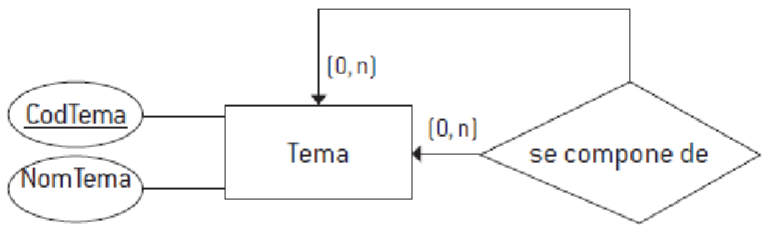
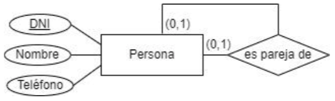

# Transformación del esquema E-R al esquema relacional

> [!fail]- ESTE APARTADO ESTÁ INCOMPLETO
> > [!todo] #TODO

En este tema vamos a estudiar las **reglas de transformación** que permiten transformar un esquema **Entidad-Relación en un esquema relacional**. Primero veremos las reglas correspondientes al modelo E-R básico y a continuación, las del modelo extendido.

Haremos referencia al siguiente esquema para presentar ejemplos:

## 4.1 Reglas concernientes al modelo E-R básico

### 4.1.1 Transformación de entidades

Cada **entidad** del esquema E-R da lugar a una **relación** o tabla en el esquema relacional.

### 4.1.2 Transformación de atributos

Cada **atributo** asociado a una entidad en el esquema E-R se convierte en un **atributo de la relación** correspondiente en el esquema relacional.

Los **atributos** identificadores principales (*AIP*) pasan a formar parte de la **clave primaria** de la relación correspondiente y llevan asociadas la restricción ***PRIMARY KEY***.

### 4.1.3 Transformación de interrelaciones binarias y reflexivas

La transformación se realiza dependiendo del tipo de correspondencia de la interrelación.

#### 4.1.3.1 Interrelaciones N:M

Toda interrelación `N:M` se convierte en ==una nueva tabla== que contiene ==dos claves ajenas== que se refieren a las ==**claves primarias** de las entidades originales==. La **clave primaria** de esta nueva tabla se forma combinando estas dos **claves ajenas**.

==Si la relación también tiene atributos adicionales, estos se incluirán en la nueva tabla==. Además, es importante definir cómo afectarán las modificaciones y eliminaciones en las tablas originales a las **tuplas** o filas de la nueva tabla.

==En el caso de que la relación sea [*reflexiva*](../t2/db_t2.md#^reflexiva), se creará una tabla similar con dos **claves ajenas** que apuntan a la misma entidad.==

#### 4.1.3.2 Interrelaciones 1:N

Las interrelaciones `1:N` se pueden representar de dos formas:

> [!important]- Resumen:
> - Si la relación es de tipo (`0,1`): puede ser `null`.
> - Si la relación es de tipo (`1,1`): no puede ser `null`.
> > [!example] Ejemplo:
> > Una mascota puede estar o no a cargo de una persona, el valor de `id_duenio` puede ser `null`, por otro lado, si una mascota siempre tiene que tener dueño, el valor de `id_duenio` nunca puede ser `null`.

- **Añadir una clave ajena en la tabla de la entidad N.** Para determinar si esta **clave ajena** es obligatoria o no, se usan las siguientes reglas:
    - Si la relación es del tipo (`1,1`) desde el lado "1", la clave ajena será obligatoria, por lo que se debe declarar con la restricción *NOT NULL*.
    - Si la relación es del tipo (`0,1`), entonces la clave ajena puede ser **nula**.
- **Crear una nueva tabla para la relación.** Este método es menos común y se utiliza en ciertos casos:
    - Cuando la cardinalidad del lado "1" es (0,1) y se anticipa que la clave ajena será a menudo nula.
    - Si la relación tiene atributos que son relevantes y se desea conservar su semántica.
    - Si se cree que la relación podría convertirse en N 
    en el futuro.

En el caso de las relaciones [*reflexivas*](../t2/db_t2.md#^reflexiva), se suele aplicar el primer método, añadiendo una **clave ajena** que haga referencia a la misma tabla.

#### 4.1.3.3 Interrelaciones 1:1

Para convertir estas relaciones al modelo relacional, se pueden usar dos métodos: propagar claves o crear una nueva tabla. La elección del método depende de las cardinalidades:

1. **Cardinalidades (`0,1`) para ambas entidades**:
    - Si ninguna de las dos entidades tiene una relación 0,1 (*obligatoria*), y se espera que no haya muchas parejas relacionadas, crearemos una nueva tabla.
    - Esta nueva tabla contendrá dos claves ajenas (una de cada entidad) y su clave primaria puede ser el identificador principal de una de ellas.
    > [!example]- Ejemplo:
    > Si tenemos una relación entre "Persona" y "Emparejamiento", donde no se espera que haya muchas parejas, se podría crear una tabla "Emparejamiento" con los DNI de ambas personas.
    > 

1. **Cardinalidad (`1,1`) en una entidad y (`0,1`) en la otra**:
    - Lo que haremos es propagar la clave de la entidad (`1,1`) a la que no lo es. Esto reduce la cantidad de valores nulos.
    - **Ejemplo**: En una relación entre "Empleado" y "Departamento", cada departamento debe tener un empleado a su cargo, pero no todos los empleados dirigen un departamento. Por lo tanto, se agregarían los datos del empleado (*CodEmp*) en la tabla de Departamento.
    > [!example]- Ejemplo:
    > Empleado (**CodEmp**, NIFEmp, NomEmp, TelEmp)
    > Departamento (**CodEmp**, NomDep, DirDep, CodEmpDir)
    > 

3. **Cardinalidad obligatoria en ambos sentidos**:
    - Si ambas entidades tienen una relación obligatoria, se puede propagar la clave en cualquiera de las dos direcciones.
    - **Ejemplo**: En una relación entre "Director" e "Instituto", donde ambos tienen que estar vinculados, se puede propagar el DNI del director al instituto o viceversa, dependiendo de cómo se desee estructurar.
    > [!example]- Ejemplo:
    > Director(**DNIDir**, NomDir, TelDir)
    > Instituto(**CodIns**, NomIns, DirIns, DNIDir)
    > Director(**DNIDir**, NomDir, TelDir, CodIns)
    > Instituto(**CodIns**, NomIns, DirIns)
    > 

### 4.1.4 Transformación de interrelaciones de grado superior a dos

Cuando se trabaja con relaciones de grado superior a dos, se crea una nueva tabla que incluye no sólo los atributos específicos de esta relación, sino también tres **claves ajenas** que apuntan a las entidades relacionadas. La **clave primaria** de esta nueva tabla se definirá dependiendo del tipo de correspondencia en la relación ternaria:

- **Para relaciones con correspondencia `N:M:P` o `N:M:1`.** La clave primaria de la nueva tabla se formará al concatenar las **claves ajenas** de las entidades con cardinalidad máxima `n`.
- **Para relaciones `N:1:1`.** La **clave primaria** consistirá en la **clave ajena** de la entidad con cardinalidad `N` y la **clave ajena** de la entidad con cardinalidad `1`.
- **Para relaciones `1:1:1`.** La **clave primaria** estará formada por las **claves foráneas** de dos de las entidades involucradas.

## 4.2 Reglas concernientes al modelo E-R extendido

### 4.2.1 Transformación de dependencias en existencia y en identificación

Las **dependencias de existencia** son relaciones entre una entidad débil y una entidad regular de la que depende. En este caso, la entidad débil está identificada por un *Atributo Identificador Principal* (*AIP*). Al convertir estas relaciones al modelo relacional, se sigue el procedimiento mencionado previamente considerando el tipo de relación (`1:1`, `1:N`, `N:M`).

Para las **claves ajenas** que se generan, es importante establecer reglas de eliminación y actualización en cascada, lo cual también es aplicable a las **dependencias de identificación**.

Las **dependencias de identificación** involucran relaciones débiles donde se necesita más que solo el *AIP* de la entidad débil para identificar cada ocurrencia, también necesitamos el *AIP* de la entidad regular de la que depende. Por lo tanto, al convertir al modelo relacional, se añade el *AIP* de la entidad regular como una clave ajena en la entidad débil, además, este atributo se incorpora a la clave primaria de la tabla de la entidad débil.

### 4.2.2 Transformación de jerarquías de tipos y subtipos

Cuando un diagrama E-R incluye una entidad supertipo y varios subtipos, hay varias maneras de transformarlo al modelo relacional. Las opciones más comunes son:

- **Opción A**: Englobar todos los atributos del supertipo y sus subtipos en una única tabla. Esta opción es recomendable solo si se cumplen tres condiciones:
    1. Los subtipos solo difieren en uno o dos atributos.
    2. No hay relaciones propias entre los subtipos y otras entidades.
    3. La jerarquía es casi total, es decir, cada supertipo generalmente tiene al menos un subtipo asociado. Esta opción ofrece acceso más rápido a los datos, ya que no requiere uniones de tablas.

- **Opción B**: Crear una tabla para el supertipo y una tabla para cada subtipo. Esta opción es más flexible y preserva mejor el modelo conceptual original, pero puede ser más lenta y ocupar más espacio, ya que implica combinar varias tablas para acceder a la información.

> [!example]- Ejemplo:
> 
>
> Opción A:
> - Cuenta: (**NumCta**, SaldoCta, TipoCta, Interés, Descubierto)
>
> Opción B:
> - Cuenta: (**NumCta**, SaldoCta, TipoCta)
> - CtaAhorro: (**NumCta**, Interés)
> - CtaCorriente: (**NumCta**, Descubierto)
