# DIAGRAMA DE CLASES

> [!help]- REFERENCIAS WEB
> - [geeksforgeeks](https://www.geeksforgeeks.org/unified-modeling-language-uml-class-diagrams/)
> 
> YouTube:
> - [Lucid Software (UML class diagrams)](https://youtu.be/6XrL5jXmTwM)

> [!faq]- FAQ
> - [¿Como puedo hacer este tipo de diagramas?](../mermaid/mermaid_class.md)

Un diagrama de clases está pensado para estructurar de una forma visual las clases de un programa informático, indicando sus nombre, [atributos](#ATRIBUTOS), [métodos](#MÉTODOS) y [relaciones](#RELACIONES) entre sí.

## CLASES

En un diagrama de clases la clases se representan con un rectángulo el cual se divide en tres secciones de forma vertical, quedando tres rectángulos apilados, el que se encuentra en la parte superior se usa para indicar el nombre de la clase, el de en medio se usa para indicar los [atributos](#ATRIBUTOS) y el de abajo para los [métodos](#MÉTODOS).

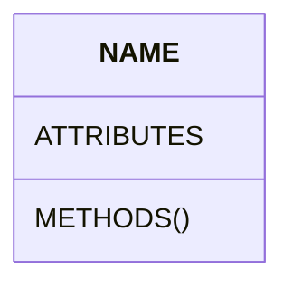

%%
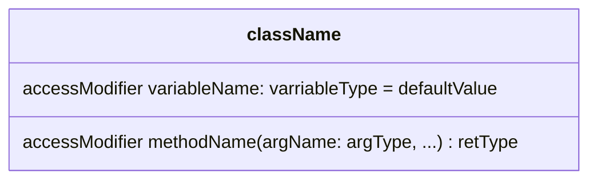
%%

### ATRIBUTOS

Los atributos de una clase son en esencia las variables que contiene y lo conforman, pudiendo ser estas número, texto incluso otras clases.

Los atributos de la clase se indican siguiendo la siguiente sintaxis:

> [!abstract] SINTAXIS
> ***[\[accessModifier\]](#MODIFICADORES%20DE%20ACCESO) \[variableName\]: \[variableType\] \{= \[defaultValue\]\}***

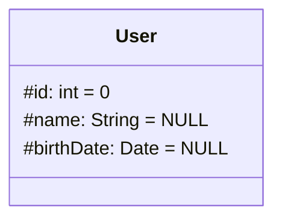

### MÉTODOS

Los métodos de la clase indican la funcionalidad de esta, las cosas que puede hacer, generalmente haciendo uso de los atributos de la propia clase o de otras.

Los métodos de la clase se indican siguiendo la siguiente sintaxis:

> [!abstract] SINTAXIS
> ***[\[accessModifier\]](#MODIFICADORES%20DE%20ACCESO) \[methodName\]***(***\[argName\]***: ***\[argType\]***) ***\[returnType\]***

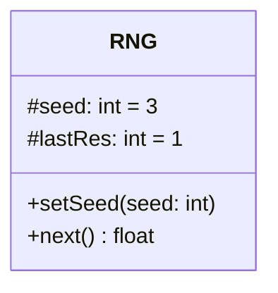

### MODIFICADORES DE ACCESO

Los modificadores de acceso se pueden aplicar tanto a los [atributos](#ATRIBUTOS) como a los [métodos](#MÉTODOS), estos indican desde donde se puede acceder a ellos.

- `public` (`+`): es visible desde dentro y fuera de la **clase**.
- `protected` (`#`): es visible desde dentro de la **clase** y sus hijas.
- `package` (`~`): es visible desde dentro del paquete.
- `private` (`-`): es visible únicamente desde dentro de la **clase**.

## RELACIONES

Las relaciones se representan con una flecha, estas se dividen en dos parte, su [tipo](#TIPOS%20DE%20RELACIONES) y la [cardinalidad](#CARDINALIDAD) de estas, pudiendo hacer combinaciones con estos dos factores.

Las relaciones generalmente representan el conocimiento de unas clases sobre la existencia de otras, como puede ser a través de una variable, en donde un objeto contiene una variable con una referencia a otro objeto.

### TIPOS DE RELACIONES

El tipo de relación se indica mediante la una flecha, esta se compone de dos partes, el cuerpo y la cabeza, dependiendo de cómo hagamos estas dos partes, indicará una cosa u otra.

#### ASOCIACIÓN

Representa la conexión entre dos clases como puede ser un *cliente* y un *pedido*, en donde el cliente puede tener varios pedidos y cada pedido puede estar asociado a un cliente.

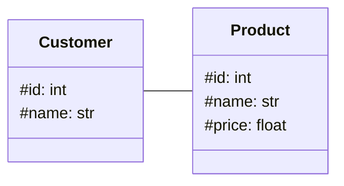

##### ASOCIACIÓN DIRIGIDA

La **asociación dirigida** indica qué clase conocer la existencia de la otra, pudiendo ser esta bidireccional.

> [!example] EJEMPLO
> Si tenemos una clase **Usuario** y esta contiene una lista de **Notas** (*la cual es otra clase*), si la clase **Nota** no conoce mediante una variable la existencia de la clase usuario, la dirección de la relación únicamente irá del **Usuario** a la o en este caso las **Notas**.

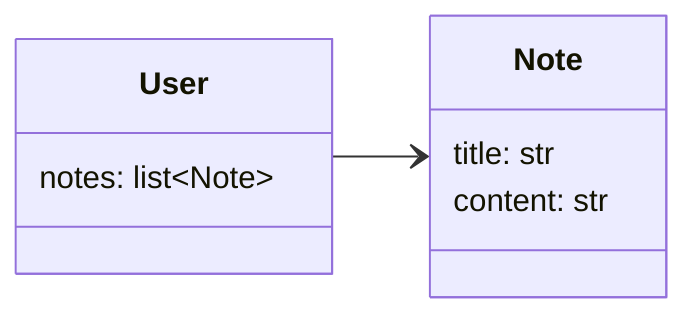

#### COMPOSICIÓN

La composición representa una relación de dependencia total, indicando que si la clase de la que se es dependiente es eliminada, la clase dependiente también desaparecerá, este tipo de relaciones son exclusivas, esto quiere decir que una clase solo puede ser dependiente de otra no de varias.

Este tipo de relaciones se representan con una flecha contínua y una punta en forma de rombo relleno, situándose la clase dependiente en el origen y de la que es dependiente en el destino.

> [!example] EJEMPLO
> Este caso se da cuando tenemos una clase **Usuario** la cual puede tener varias **Notas** que él haya escrito, si este **Usuario** desaparece podríamos querer que sus **Notas** desaparezcan son sigo ya que ya no vamos a guardar su información, esto hace que las **Notas** sean completamente dependientes del **Usuario** ya que su existencia depende de este.

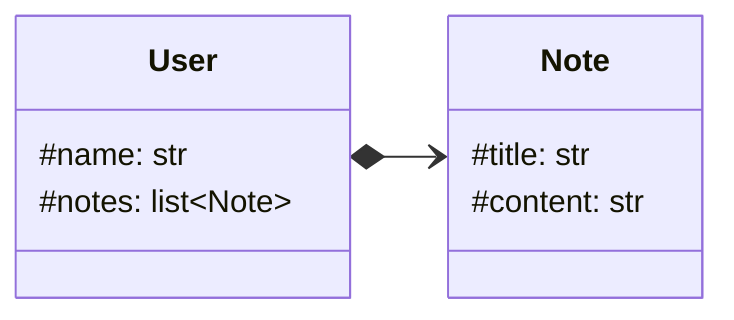

#### AGREGACIÓN

La agregación se cumple cuando una clase es parcialmente dependiente de otra, esto quiere decir que la clase dependiente no desaparece cuando se borra la clase de la cual es dependiente, este tipo de relación se representa con una flecha contínua y punto de rombo hueca, situándose la clase dependiente en el origen y de la que es dependiente en el destino de la flecha.

> [!example] EJEMPLO
> La clase **Equipo** se compone de varias **Personas** (*la cual es también una clase*), esto implica que cada **Persona** es una agregación del **Equipo**, pero si borramos el equipo la **Persona** no tendría que desaparecer.

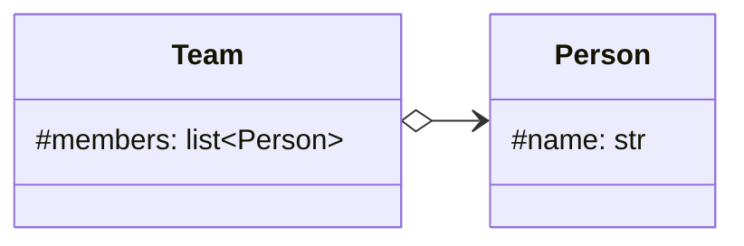

#### HERENCIA

Para representar la herencia entre dos clases se usa una flecha contínua con punta en forma triangular, situándose la clase hija en el origen y la padre en la punta de la flecha.

> [!example] EJEMPLO
> Si tenemos una clase **Persona** de la cual heredan la clase **Profesor** y **Estudiante**, estas dos últimas tendrán una flecha cada una que apuntará a la clase **Persona** indicando así que son hijas de ésta.

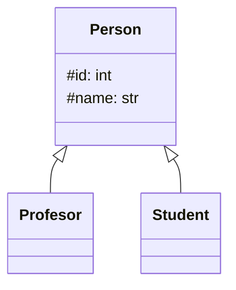

##### REALIZACIÓN

Una realización se da cuando una clase implementa una **interfaz** esta se representa con una flecha discontinua y con una punta triangular, situándose la **interfaz** en la punta de la flecha y la clase la cual la implementa en el origen.

> [!example] EJEMPLO
> Un caso de esto sería cuando estamos creando unas clases las cuales se van a encargar de gestionar las entidades de una base de datos y queremos que todos los gestores contengan los mismos métodos, en ese caso implementaremos una interfaz.

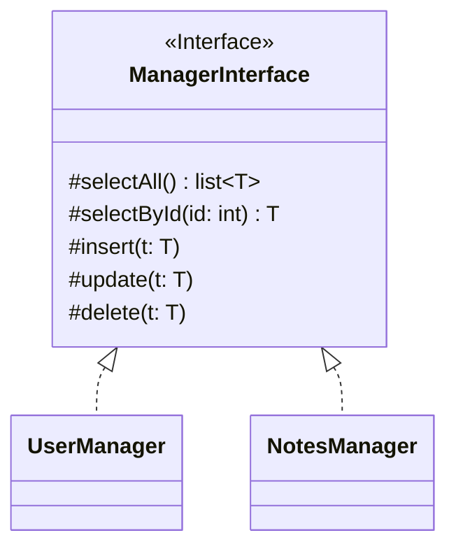

#### DEPENDENCIA

Una relación de dependencia representa cuando una clase requiere de otra para algunas de sus utilidades y por tanto no pueda desempeñarlas a no ser que la clase de la cual tiene esta dependencia exista.

> [!example] EJEMPLO
> Una **Persona** que tiene la capacidad de leer un **Libro** requiere de uno para poder leerlo, por lo que sin este, no podrá desempeñar esa tarea.

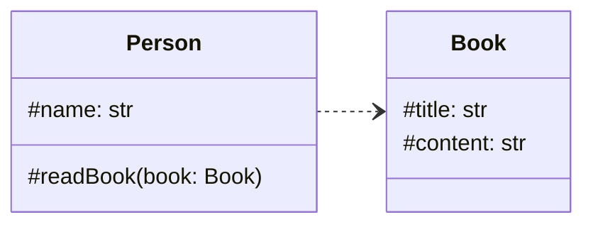

### CARDINALIDAD

La cardinalidad indica con cuantas clases de un mismo tipo se puede relacionar una clase, esto se entiende mejor con un ejemplo.

> [!example] EJEMPLO
> Un *escritor* **puede escribir varios** *libros*, a su vez cada *libro* solo puede estar escrito por **un** *autor*.

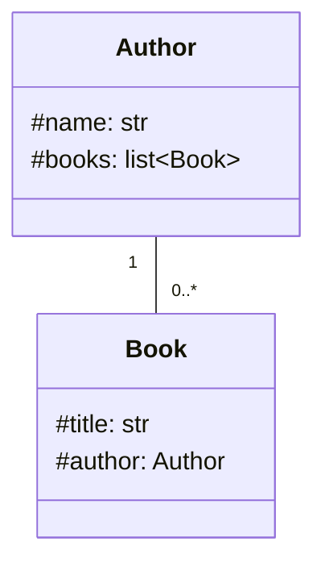

| TIPO             | SIGNO  |
|:---------------- |:------:|
| Uno              |  `1`   |
| De cero a uno    | `0..1` |
| De cero a varios | `0..*` |
| De uno a varios  | `1..*` |
| Exactamente N    |  `N`   |
| De N a M         | `N..M` |
