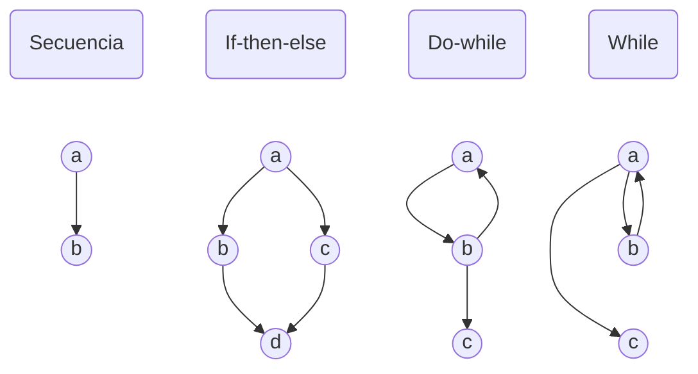
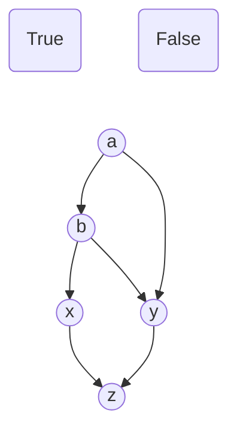
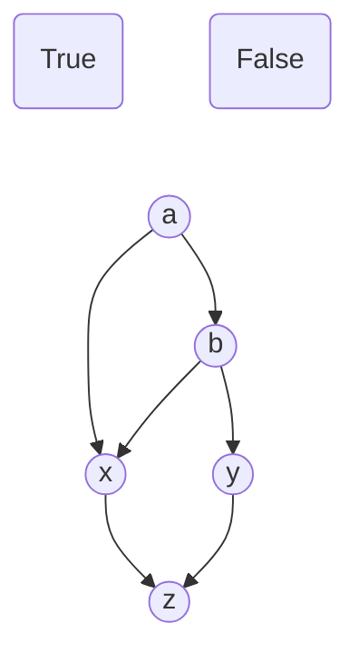
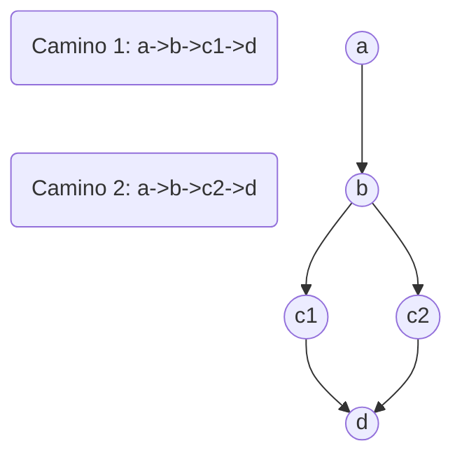

---
aliases:
  - White box
author: Mindusting
corrected: false
tags:
  - Programming/DE
title: Caja blanca
---

# CAJA BLANCA

Las pruebas de **caja blanca** se hacen para garantizar que las funciones de un programa cumplen con los siguientes puntos:

- Que se pueden ejecutar todos los caminos que se encuentran dentro de una función por lo menos una vez.
- Que se puedan ejecutar todas las condiciones como verdaderas o falsas.
- Que se ejecuten los bucles con sus límites.
- Que los datos internos son válidos.

Existen varios tipos de variantes de java blanca:

- [Prueba de camino básico](#PRUEBA%20DE%20CAMÍNO%20BÁSICO)
- [Prueba de la estructura de control](#PRUEBA%20DE%20ESTRUCTURA%20DE%20CONTROL)

## PRUEBA DE CAMÍNO BÁSICO

Este tipo de prueba permite al diseñador obtener la complejidad de la función mediante el conjunto de camions de ejecución.

Los casos de prueba garantizan que durante la prueba se ejecutaron por lo menos una vez cada sentencia de la función.

Para determinar esto, primero se debe realizar un **grafo de flujo**.

### GRAFO DE FLUJO

Un **grafo de flujo** es en esencia un [diagrama de flujo](de_flowchart.md) muy simplificado.




---

Si hay condiciones con operadores `AND` u `OR`, estos se deben descomponer:

```python
def func(a, b):
    if a and b:
        # X
    else:
        # Y
    # Z
```



---

```python
def func(a, b):
    if a or b:
        # X
    else:
        # Y
    # Z
```



---

Un **camino independiente** es aquél que introduce como mínimo una nueva sentencia o condición de la función.



Si se pueden dar las condiciones en las que el programa sea capaz de recorres la función por cualquiera de los caminos, se habrá garantizado que la función no contiene código muerto.

### COMPLEJIDAD CICLOMÁTICA

La **complejidad ciclomática** es una métrica de *software* que indica la complejidad de un programa/función.

En el contexto de [*prueba de camino básico*](#PRUEBA%20DE%20CAMÍNO%20BÁSICO) representa el número de caminos independientes de la función, indicándonos así el número mínimo de pruebas que debemos hacer para comprobar todos los caminos disponibles por lo menos una vez.

La **complejidad ciclomática** se puede calcular de varias formas:

1. Contando el número de *regiones* del [**grafo**](#GRAFO%20DE%20FLUJO), cada *region* está delimitada por las aristas y nodos de este.
2. Calculando la con la siguiente fórmula, en donde `A` es el número de *aristas* y `N` es el número de *nodos*:
    $$V(G) = A - N + 2$$
3. Contar todos los nodos de los que salgan dos aristas y sumarle uno.

## PRUEBA DE ESTRUCTURA DE CONTROL

La [prueba del camino básico](#PRUEBA%20DE%20CAMÍNO%20BÁSICO) es útil pero no es suficiente por sí sola, por ello se utiliza la prueba de **control de flujo**.

Hay dos variantes de la prueba de la estructura de control:

- [Prueba de condiciones](#PRUEBA%20DE%20CONDICIONES)
- [Prueba de bucles](#PRUEBA%20DE%20BUCLES)

### PRUEBA DE CONDICIONES

La **prueba de condiciones** consiste en revisar una por una todas las **condiciones**, viendo que todas las condiciones se puede cumplir como verdaderas o falsas, pasando así por todas las ramificaciones, esto sirve para comprobar que no hay código muerto.

### PRUEBA DE BUCLES

La **prueba de bucles** consiste en revisar que los **bucles** superan las siguientes pruebas de la forma en que nosotros esperamos:

> [!note] NOTA
> `n` hace referencia al máximo número de iteraciones en el bucle.

- No se entra en el bucle.
- Pasa 1 vez por el bucle.
- Pasa 2 veces por el bucle.
- Pasan `m` veces por el bucle, donde `m` < `n`.
- Hacer `n-1`, `n` y `n+1` pasos por el bucle.

En el caso de ser bucles anidados:

1. Comenzar por el bucle más interno y el resto de bucles con los valores mínimos.
2. Ir haciendo las pruebas desde dentro hacia afuera.
3. Continuar hasta que se termine todas las pruebas con todos los bubles.
