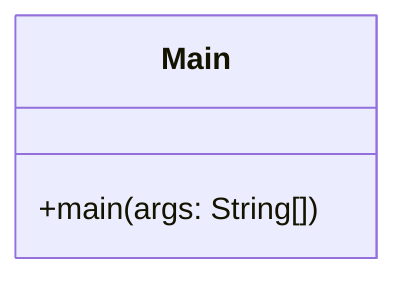

# DIAGRAMA DE CLASE EN MERMAID

> [!fail]- ESTE APARTADO ESTÁ INCOMPLETO
> > [!todo] #TODO
> > - [ ] Documentar las clases.
> > - [ ] Documentar los modificadores de acceso.
> > - [ ] Documentar las relaciones.

> [!help]- REFERENCIAS WEB
> - [Mermaid doc (Class diagram)](https://mermaid.js.org/syntax/classDiagram.html)

> [!faq]- FAQ
> - [¿Qué es un diagrama de clase?](../de/de_class_diagram.md)

## CLASES

### ATRIBUTOS

### MÉTODOS

### MODIFICADORES DE ACCESO

| TYPE        | CHAR |
|:----------- |:----:|
| `public`    | `+`  |
| `protected` | `#`  |
| `package`   | `~`  |
| `private`   | `-`  |
^access-modifier-table

| TYPE       | CHAR |
|:---------- |:----:|
| `abstract` | `*`  |
| `static`   | `$`  |

## RELACIONES

> [!abstract] SINTAXIS
> ***[\[class\]](#CLASES) [\[cardinality\]](#CARDINALIDAD) [\[arrow\]](#FLECHAS) [\[cardinality\]](#CARDINALIDAD) [\[class\]](#CLASES)*** : ***\[label\]***

Los *dos puntos* y *label* son opcionales, sirve para poner un texto en la relación, no suele ser común su uso.

### FLECHAS

Las flechas se componen de dos partes, la [línea](#^arrow-lines) y la/s [punta/s](#^arrow-heads), pudiendo estar estas últimas a los dos lados de las flechas.

> [!abstract] SINTAXIS
> ***[\[head\]](#^arrow-heads)[\[line\]](#^arrow-lines)[\[head\]](#^arrow-heads)***

> [!quote] Tipos de línas:
> - (`--`): Contínua.
> - (`..`): Discontínua.
^arrow-lines

> [!quote] Tipos de puntas:
> - (` `): *Sin punta*.
> - (`*`): Rombo lleno.
> - (`o`): Rombo vacío.
> - (`>`): Flecha.
> - (`|>`): Triángulo.
^arrow-heads

### CARDINALIDAD
