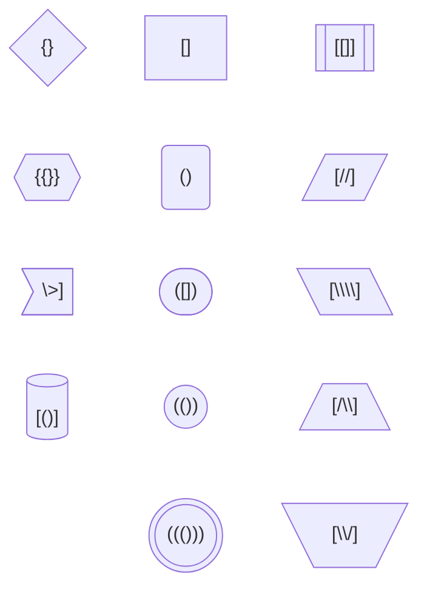

---
aliases:
  - Flowchart in Mermaid
author: Mindusting
corrected: false
tags:
  - Mermaid
title: Diagrama de flujo en Mermaid
---

# DIAGRAMA DE FLUJO EN MERMAID

> [!fail]- ESTE APARTADO ESTÁ INCOMPLETO
> > [!todo] #TODO
> > - [ ] Documentar nodos.
> >     - [ ] Documentar los niveles de los nodos.
> > - [ ] Documentar conexiones.
> >     - [ ] Documentar los tipos de conexiones.
> >     - [ ] Documentar los tipos de puntas.
> >     - [ ] Documentar como meter texto en una conexión.
> > - [ ] Documentar subgrafos.

> [!help]- REFERENCIAS WEB
> - [Mermaid doc (Flowchart)](https://mermaid.js.org/syntax/flowchart.html)

> [!faq]- FAQ
> - [¿Qué es un diagrama de flujo?](../de/de_flowchart.md)

| TOKEM | DIRECCIÓN                                         |
|:-----:|:------------------------------------------------- |
| `TB`  | De arriba a abajo (*Top Bottom*)                  |
| `TD`  | De arriba a abajo (*Top Down*) (*igual que `TB`*) |
| `BT`  | De abajo a arriba (*Bottom Top*)                  |
| `LR`  | De izquierda a derecha (*Left Rigth*)             |
| `RL`  | De derecha a izquierda (*Rigth Left*)             |

> [!abstract] SINTAXIS
> flowchart ***\[direction\]***

```txt
flowchart TB
```

## NODOS


## FORMAS

| ENVOLTORIO  | FOMRA                        |
|:-----------:|:---------------------------- |
|   `[` `]`   | Rectánculo                   |
|   `(` `)`   | Esquinas redondeadas         |
|  `([` `])`  | Laterales redondos           |
|  `[[` `]]`  | Rectanculo con doble lateral |
|  `[(` `)]`  | Cilindro (DB)                |
|  `((` `))`  | Círculo                      |
| `(((` `)))` | Doble círculo                |
|   `>` `]`   | Forma asimétrica             |
|   `{` `}`   | Rombo                        |
|  `{{` `}}`  | Hexágono                     |
|  `[/` `/]`  | Paralelogramo                |
|  `[\` `\]`  | Paralelogramo alternativo    |
|  `[/` `\]`  | Trapezoide                   |
|  `[\` `/]`  | Trapezoide alternativo       |



## CONEXIONES

| TIPO               | FORMA 1 | FORMA 2 | FORMA 3  |
|:------------------ |:-------:|:-------:|:--------:|
| Línea invisible    |  `~~~`  | `~~~~`  | `~~~~~`  |
| Línea normal       |  `---`  | `----`  | `-----`  |
| Flecha normal      |  `-->`  | `--->`  | `---->`  |
| Línea gorda        |  `===`  | `====`  | `=====`  |
| Flecha gorda       |  `==>`  | `===>`  | `====>`  |
| Línea discontinua  |  `-.-`  | `-..-`  | `-...-`  |
| Flecha discontinua | `-.->`  | `-..->` | `-...->` |

| TIPO      | PUNTAS |
|:--------- |:------:|
| Triángulo | `<-->` |
| Circulo   | `o--o` |
| Equis     | `x--x` |

## SUBGRAFOS

> [!abstract] SINTAXIS
> subgraph ***\[title\]***
> ***\[content\]***
