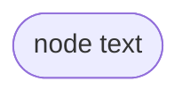

---
aliases:
  - Flowchart in Mermaid
author: Mindusting
corrected: false
tags:
  - Mermaid
title: Diagrama de flujo en Mermaid
---

# DIAGRAMA DE FLUJO EN MERMAID

> [!fail]- ESTE APARTADO ESTÁ INCOMPLETO
> > [!todo] #TODO
> > - [ ] Documentar nodos.
> >     - [ ] Documentar los niveles de los nodos.
> > - [ ] Documentar conexiones.
> >     - [ ] Documentar los tipos de conexiones.
> >     - [ ] Documentar los tipos de puntas.
> > - [ ] Documentar subgrafos.

> [!help]- REFERENCIAS WEB
> - [Mermaid doc (Flowchart)](https://mermaid.js.org/syntax/flowchart.html)

> [!faq]- FAQ
> - [¿Qué es un diagrama de flujo?](../de/de_flowchart.md)

## NODOS


### BORDE REDONDEADO

```txt
flowchart TB
    node(node text)
```


### FORMA DE ESTADIO

```txt
flowchart TB
    node([node text])
```



### FORMA DE SUBRUTINA

```txt
flowchart TB
    node[[node text]]
```


### CILINDRO

```txt
flowchart TB
    node[(node text)]
```


### CÍRCULO

```txt
flowchart TB
    node((node text))
```


### FROMA ASIMÉTRICA

```txt
flowchart TB
    node>node text]
```


### ROMBO

```txt
flowchart TB
    node{node text}
```


### HEXÁGONO

```txt
flowchart TB
    node{{node text}}
```


### PARALELOGRAMO

```txt
flowchart TB
    node[/node text/]
```


### PARALELOGRAMO ALTERNATIVO

```txt
flowchart TB
    node[\node text\]
```


### TRAPEZOIDE

```txt
flowchart TB
    node[/node text\]
```


### TRAPEZOIDE ALTERNATIVO

```txt
flowchart TB
    node[\node text/]
```


### DOBLE CIRCULO

```txt
flowchart TB
    node(((node text)))
```


## CONEXIONES

| TIPO               | FORMA 1 | FORMA 2 | FORMA 3  |
|:------------------ |:-------:|:-------:|:--------:|
| Línea normal       |  `---`  | `----`  | `-----`  |
| Flecha normal      |  `-->`  | `--->`  | `---->`  |
| Línea gorda        |  `===`  | `====`  | `=====`  |
| Flecha gorda       |  `==>`  | `===>`  | `====>`  |
| Línea discontinua  |  `-.-`  | `-..-`  | `-...-`  |
| Flecha discontinua | `-.->`  | `-..->` | `-...->` |

| TIPO      | PUNTAS |
|:--------- |:------:|
| Triángulo | `o--o` |
| Circulo   | `<-->` |
| Equis     | `x--x` |

## SUBGRAFOS

> [!abstract] SINTAXIS
> subgraph ***\[title\]***
> ***\[content\]***
> end
