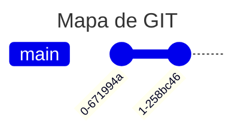

# DIAGRAMA DE GIT EN MERMAID

> [!fail]- ESTE APARTADO ESTÁ INCOMPLETO
> > [!todo] #TODO

> [!help]- REFERENCIAS WEB
> - [Mermaid (GIT)](https://mermaid.js.org/syntax/gitgraph.html)

---

```mermaid
---
title: Mapa de GIT
---
gitGraph
   commit
   commit
```
