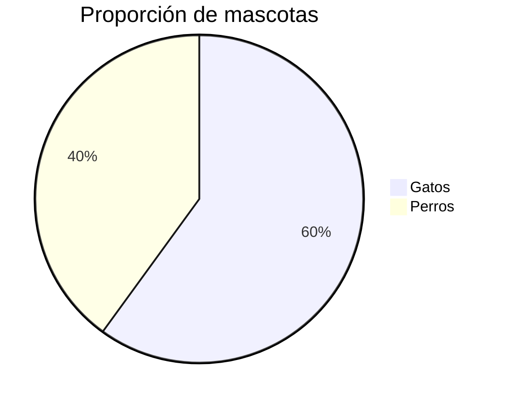
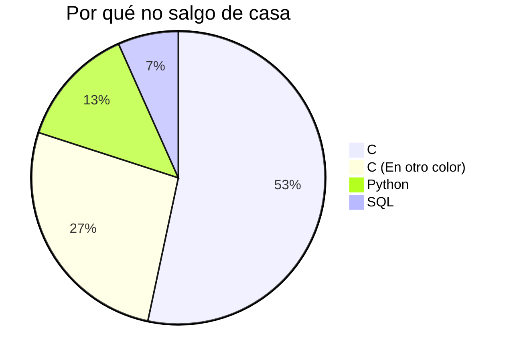

# DIAGRAMA CIRCULAR EN MERMAID

> [!fail]- ESTE APATADO ESTÁ INCOMPLETO
> > [!todo] #TODO
> > - [ ] Documentar que son los diagrama circulares y sus usos.

> [!help]- REFERENCIAS WEB
> - [Mermaid doc (Pie Chart)](https://mermaid.js.org/syntax/pie.html)

Para poder crear un diagrama de (proporción, circular o "*de pastel*") debemos seguir la siguiente sintaxis:

> [!abstract] SINTAXIS
> [***\[header\]***](#ENCABEZADO)
> [***\[key-value\]***](#VALORES)
> ***...***

## ENCABEZADO

El identificador de los diagramas de PIE es el `pie`; se puede poner de forma opcional la palabra clave `title` seguido del título que queremos que tenga el esquema.

> [!abstract] SINTAXIS
> pie ***\{title \[title\]}***

> [!example] EJEMPLO
> ```txt
> pie title Este es mi título
> ```

## VALORES

Para indicar los valores que se deben mostrar en el diagrama se hace mediante un par de *clave*, *valor*; estos se separan por *dos puntos* (`:`) y dos *espacios* a cada lado.

> [!abstract] SINTAXIS
> "***\[key\]***" : ***\[value\]***

```mermaid
pie
```

---



---

```txt
pie title Por qué no salgo de casa
    "C" : 256
    "C (En otro color)" : 128
    "Python" : 64
    "SQL" : 32
```

---


