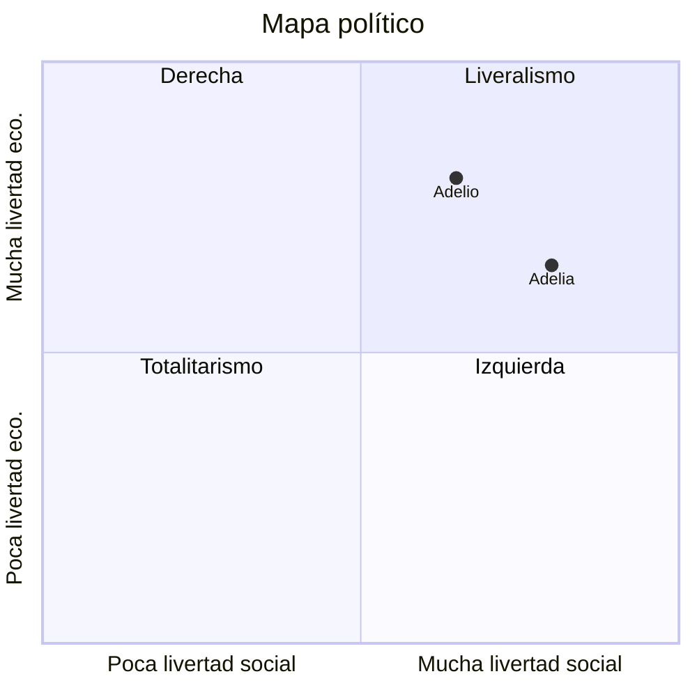

# DIAGRAMA CIRCULAR EN MERMAID

> [!fail]- ESTE APATADO ESTÁ INCOMPLETO
> > [!todo] #TODO

> [!help]- REFERENCIAS WEB
> - [Mermaid doc (Quadrant Chart)](https://mermaid.js.org/syntax/quadrantChart.html)

Cuadrantes:
1. Arriba a la derecha.
2. Arriba a la izquierda.
3. Abajo a la izquierda.
4. Abajo a la derecha.

