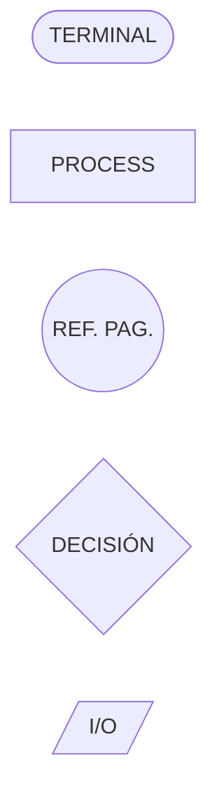
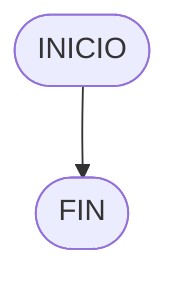
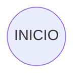

# DIAGRAMA DE FLUJO

> [!fail]- ESTE APARTADO ESTÁ INCOMPLETO
> > [!todo] #TODO
> > - [ ] Documentar terminales.
> > - [ ] Documentar instrucciones.
> > - [ ] Documentar IO.
> > - [ ] Documentar condicionales/bucles.

> [!faq] FAQ
> - [¿Como puede hacer diagramas de flujo en Mermad/Obsidian?](../mermaid/mermaid_flowchart.md)

Los **diagramas de flujo** representan los caminos que puede tomar un programa de forma visual.

## SIMBOLOS

### TERMINAL

El objetivo del terminal 

### OPERACIONES

### REFERENCIA DE PÁGINA

