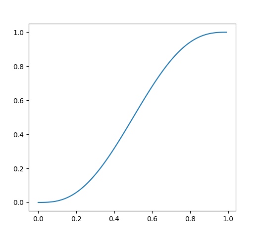

# MATEMÁTICAS

- [Vectors](Vectors/vectors.md)
- [Geometry](Trigonometry/trigonometry.md)
- [Matrix](Matrix/matrix.md)
- [Pitagoras](math_pitagoras.md)
- [Contar tanques](math_count_tanks.md)
- [Notación de intervalo](math_range_notation.md)
- [Logaritmo](math_log.md)

## INTERPOLATION

### FADE

Si queremos hacer transformar una interpolación lineal a una más suavizada podemos usar la siguiente fórmula:

$$
r = 6t^5-15t^4+10t^3
$$

```python
def fade(t: float) -> float:
    if t < 0:   return 0
    elif t > 1: return 1
    return 6*t**5-15*t**4+10*t**3
```

```python
def fade(t: float) -> float:
    if t < 0:   return 0
    elif t > 1: return 1
   return t*t*t*(t*(t*6-15)+10)
```


