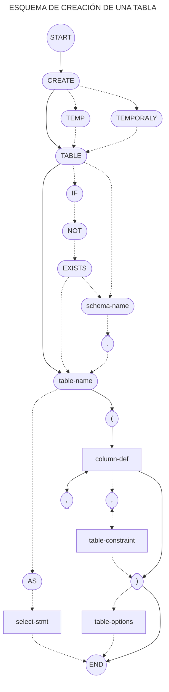

```txt
o─>(CREATE)┬────────────┬>(TABLE)┬>(IF)─>(NOT)─>(EXISTS)┐
           ├>(TEMP)─────┤        │                      │
           └>(TEMPORARY)┘        │                      │
┌─────────────────<──────────────┴─────────────<────────┘
├─>(schema-name)─>(.)┬>(table-name)┬>(AS)─>[select-stmt]───────>─────┐
└───────>────────────┘             │                                 │
┌───────────────────<──────────────┘                ┌────────>───────┼>o
└─>(()┬>[column-def]┬>┬────────────────────────┬>())┴>[table-options]┘
      └──────(,)<───┘ └[table-constraint]<─(,)<┘
```



