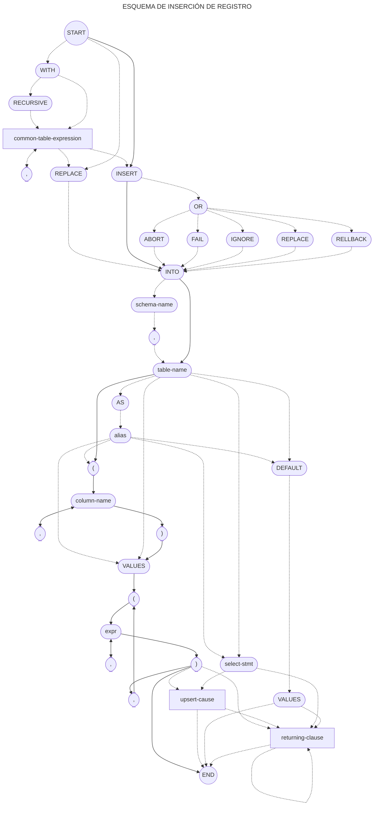

```txt
o┬>(WITH)┬─────>────────┬┬>[common-table-expression]┐
 v       └>(RECURSIVE)─>┘└────────────(,)<──────────┤
 ├──────────────────────<───────────────────────────┘
 ├>(REPLACE)───────────────────┬>(INTO)┐
 └>(INSERT)┬──────────────────>┤       │
           └>(OR)┬>(ABORT)────>┤       │
                 ├>(FAIL)─────>┤       v
                 ├>(IGNORE)───>┤       │
                 ├>(REPLACE)──>┤       │
                 └>(RELLBACK)─>┘       │
┌─────────────<─────┬──────────────────┘
│                   v
└>(schema-name)─>(.)┴>(table-name)┬>(AS)─>(alias)┐
                                  v              │
┌─────────────────────────────────┴─────<────────┘
├>(()┬>(column-name)┬>())┐
│    └──────(,)<────┘    │
├────────────<───────────┘
├>(VALUES)┬>(()┬>[expr]┬>())┬─────────────────>┐
│         │    └──(,)<─┘    ├>[upsert-clause]─>┤
│         └───────(,)<──────┘                  │
├>[select-stmt]─────────────┬─────────────────>┤
│                           └>[upsert-clause]─>┤
└>(DEFAULT)─>(VALUES)─────────────────────────>┤
                          ┌──────────<─────────┤
                          └>[returning-clause]─┴─o
```


