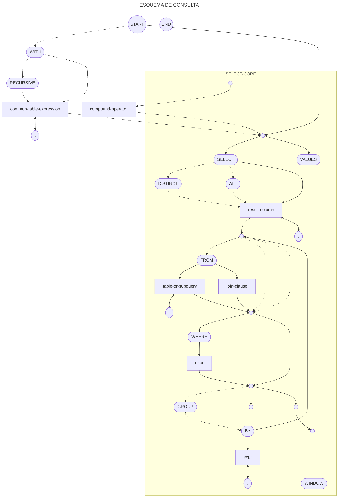
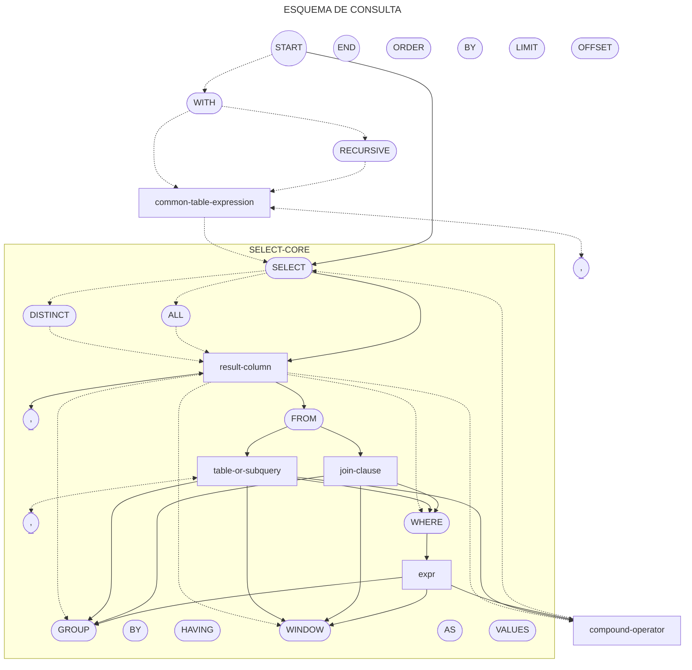

<h1 style="text-align:center;">SELECT EN SQLITE</h1>

---

[WEB - SQLite3 (SELECT)](https://sqlite.org/lang_select.html)

Para hacer una consulta tendremos que seguir el siguiente esquema:

%%
ESQUEMA DE CONSULTA DE DATOS

```txt
o┬>(WITH)┬─────>────────┬─┬>[common-table-expression]┐
 v       └>(RECURSIVE)─>┘ └────────────(,)<──────────┤
 ├──────────────────────<────────────────────────────┘
 │ ┌ ─ ─ ─ ─ ─ ─ ─ ─ ─ ─ ─ ─ ─ ─ ─ ─ ─ ─ ─ ─ ─ ─ ─ ─ ─
┌┴─>┬─>(SELECT)┬─────>───────┬─┬>[result-column]┐    s│
│  ││          ├>(DISTINCT)─>┤ └───────(,)<─────┤    e 
│   │          └>(ALL)──────>┘                  v    l│
^  ││ ┌──────────────────────<──────────────────┘    e 
│   │ ├>(FROM)┬─┬>[table-or-subquery]┬─┬>┐           c│
│  ││ │       │ └─────────(,)<───────┘ ^ v           t 
│   │ │       └─────>[join-clause]─────┘ │           -│
│  ││ ├─────────────────────<────────────┘           c 
│   │ ├>(WHERE)─>[expr]┐                             o│
│  ││ v                │                             r 
│   │ ├────────<───────┘                             e│
│  ││ ├─────────>─────────────┐
│   │ ├>(GROUP)─>(BY)┬>[expr]┬┴>┬>(HAVING)─>[expr]┬┐  │
│  ││ v              └──(,)<─┘  └──────>──────────┘v
│   │ ├─────────────────────<──────────────────────┘  │
│  ││ ├>(WINDOW)┬>(window-name)─>(AS)─>[windows-defn]┐
│   │ │         └────────────────(,)<────────────────┤│
│  ││ │                                              v
│   │ └───────────────────>──────────────────────────┤│
│  ││               ┌──(,)<─┐                        │
│   └─>(VALUES)┬>(()┴>[expr]┴>())┬──────────────────>┤│
│  │           └───────(,)<──────┘                   │
│   ─ ─ ─ ─ ─ ─ ─ ─ ─ ─ ─ ─ ─ ─ ─ ─ ─ ─ ─ ─ ─ ─ ─ ─ ─│┘
└──────────────[compound-operator]<──────────────────┤
┌────────────────────<───────────────────────────────┘
├>(ORDER)─>(BY)─┬>[ordering.term]┬┐
v               └──────(,)<──────┘│
├───────────────<─────────────────┘
├>(LIMIT)─>[expr]─>┬──────────────────>┐
│                  ├>(OFFSET)─>[expr]─>┤
│                  └>(,)─>[expr]──────>┤
└─────────────────────────────────────>┴>─o
```
%%



%%

%%

Un ejemplo de ello sería el siguiente:

```sql
SELECT id, name FROM users;
```
